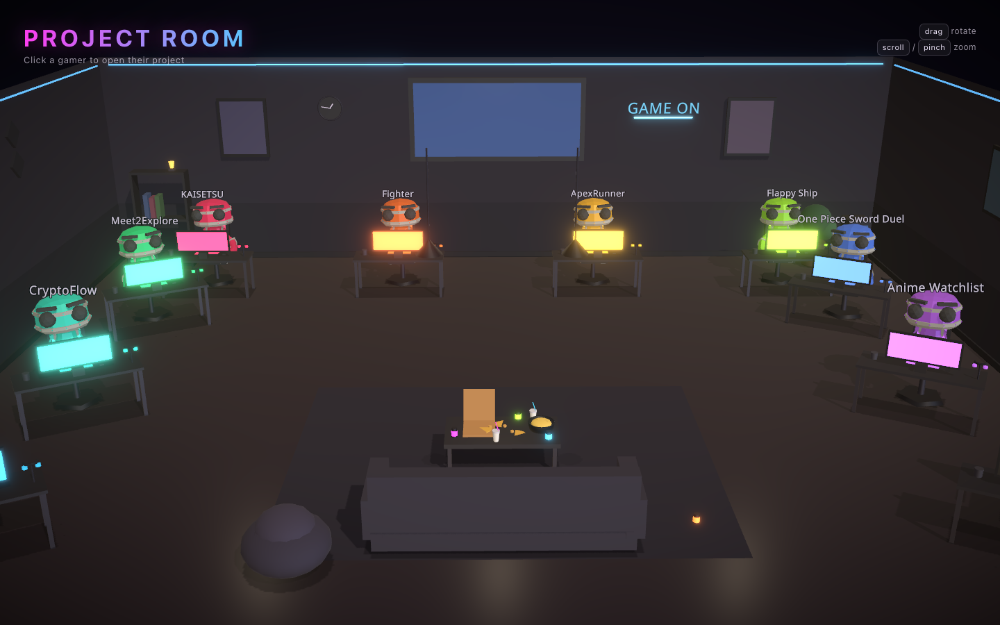

# Project Room

An interactive 3D **gaming lounge**, in the browser, where each of my projects
is a gamer seated at their own glowing battlestation. Click (or tap, or
keyboard-select) a gamer and the camera glides over while a card slides up with
the project's blurb and a link to its repo or live demo.

Everyone is generated from a data array of my real
[github.com/Toshkee](https://github.com/Toshkee) projects — desks, chairs,
accent-lit monitors and the seated bots all come from one `PROJECTS` list plus a
matching `STATIONS` seating chart.



## Stack

- **[Vite](https://vite.dev/)** + **React 19** + **TypeScript**
- **[three](https://threejs.org/)** via **[@react-three/fiber](https://r3f.docs.pmnd.rs/)** — declarative Three.js
- **[@react-three/drei](https://drei.docs.pmnd.rs/)** — `OrbitControls`, `Environment` (HDRI lighting), `ContactShadows`, `useGLTF` + `useAnimations`, `Text`, `Billboard`
- **[@react-three/postprocessing](https://react-postprocessing.docs.pmnd.rs/)** — a restrained **bloom** so only the screens / RGB / signs glow

Lighting is image-based (a vendored CC0 HDRI) plus a shadow-casting key light;
materials are physically-based. The characters are one rigged CC0 model
(RobotExpressive) skeleton-cloned per seat and tinted to each project's accent.

No backend, no database, no `localStorage` — the scene is entirely in-memory.

## Commands

```bash
npm install      # install dependencies
npm run dev      # dev server at http://localhost:5173 (HMR)
npm run build    # type-check + production build to dist/
npm run preview  # serve the built dist/ locally
npm run typecheck
```

## Project structure

```
index.html              # mount point + meta
public/
  models/RobotExpressive.glb   # the gamer bot (CC0, rigged, has a "Sitting" clip)
  hdri/lebombo.hdr             # interior HDRI for image-based lighting
  previews/<id>.jpg            # per-project card preview images
src/
  main.tsx              # React root
  App.tsx               # Canvas (perspective, shadows) + overlay + state
  index.css             # all HUD / card styling (neon UI chrome)
  theme.ts              # palette + room dimensions + asset URLs
  data/
    projects.ts         # PROJECT DATA — the single source of truth
    stations.ts         # STATIONS — where each gamer sits (index-aligned)
  scene/
    Scene.tsx           # composes the lounge + controls + camera focus rig
    Lighting.tsx        # HDRI environment + key light + warm fills
    Room.tsx            # floor, walls, ceiling, LED cove, wall TV
    GamerCharacter.tsx  # loads + clones + tints + animates the bot
    GamingStation.tsx   # desk, chair, monitor, peripherals, the seated bot, select
    Lounge.tsx          # rug, sofa, coffee table
    FoodDrinks.tsx      # pizza, cans, cups, snacks
    Decor.tsx           # plants, shelf, PC tower, pendant lamps, beanbag
    WallDressing.tsx    # framed art, neon sign, clock, acoustic panels
    Effects.tsx         # bloom + vignette
  components/
    Hud.tsx             # title + controls hint
    ProjectCard.tsx     # slide-up info panel
```

## Adding or changing a project

Add an entry to `PROJECTS` in [`src/data/projects.ts`](src/data/projects.ts)
**and** a matching seat to `STATIONS` in
[`src/data/stations.ts`](src/data/stations.ts) (the arrays are index-aligned).
Everything else — the gamer, desk, glowing monitor and nameplate — is generated:

```ts
// projects.ts
{
  id: 'my-thing',
  name: 'My Thing',
  tag: 'Web App',
  hex: 0x4dd2ff,          // THREE accent color (monitor glow, RGB)
  css: '#4dd2ff',         // matching CSS accent for the card
  glyph: '✦',             // small emblem shown in the card
  blurb: 'One or two sentences for the info card.',
  link: 'https://…',      // optional: wires the "Open project →" button
}

// stations.ts (same index)
{ pos: [6.3, 0.2], faceY: -0.5 }   // [x, z] seat + yaw toward the room center
```

Set `add: true` on a project for the empty "Reserved" station.

## Controls

| Action | Mouse | Touch | Keyboard |
| --- | --- | --- | --- |
| Rotate | drag | one-finger drag | — |
| Zoom | scroll | two-finger pinch | — |
| Select | click a gamer | tap a gamer | Tab to a gamer, Enter |
| Close card | × / `Esc` | × | `Esc` |

## Deploy

`npm run build`, then host `dist/` on any static host (GitHub Pages, Netlify,
Vercel). Asset paths are relative (`base: './'`, and the model/HDRI load via
`import.meta.env.BASE_URL`), so sub-path hosting works.
